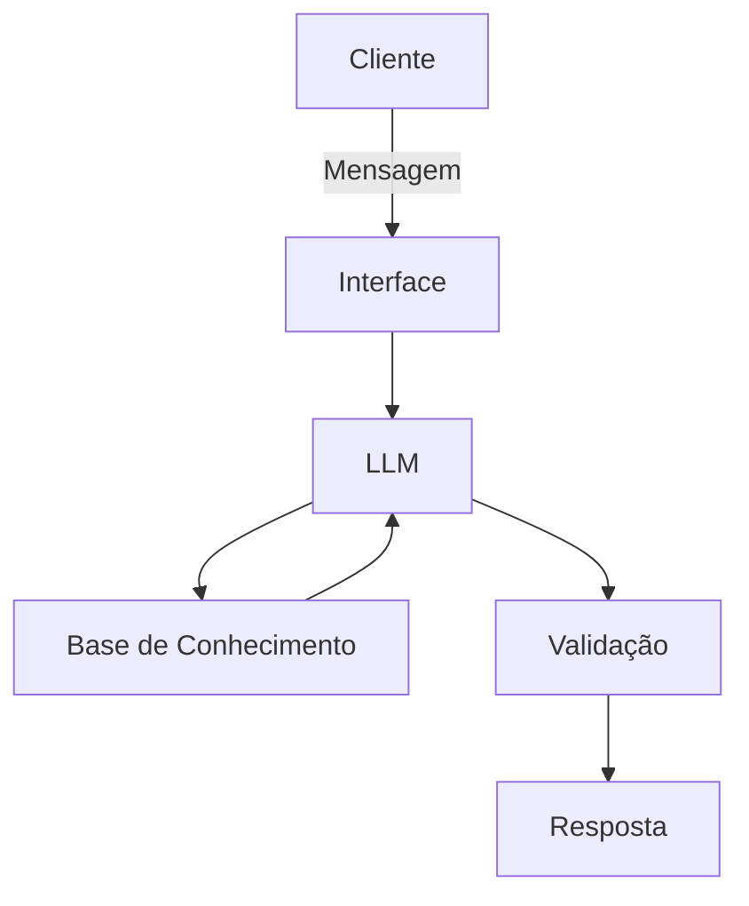

# Documentação do Agente

## Caso de Uso

### Problema
> Qual problema financeiro seu agente resolve?

A falta de literacia financeira básica e a dificuldade de transformar o desejo de "guardar dinheiro" em um plano prático. Muitas pessoas iniciantes se sentem intimidadas pelo "economês" (termos complexos do mercado), não sabem por onde começar a organizar o orçamento mensal e têm dificuldade em calcular quanto precisam poupar para atingir uma meta específica (como criar uma reserva de emergência, fazer uma viagem ou comprar um carro).

### Solução
> Como o agente resolve esse problema de forma proativa?

O agente atua como um guia financeiro simplificado e interativo. De forma proativa, ele não apenas responde a perguntas sobre conceitos financeiros (como "O que é um CDB?" ou "Como funciona a taxa Selic?"), mas também incentiva o usuário a agir. Ele faz isso oferecendo simulações de metas: o usuário diz o que quer comprar e em quanto tempo, e o agente calcula quanto ele precisa guardar por mês, sugerindo produtos financeiros adequados ao seu perfil (com base estrita na documentação fornecida, focando em baixo risco e liquidez). O agente quebra a barreira do conhecimento usando linguagem simples, analogias do dia a dia e persistência de contexto para acompanhar o raciocínio do usuário.

### Público-Alvo
> Quem vai usar esse agente?

Jovens adultos (18 a 30 anos), universitários, profissionais em início de carreira ou qualquer pessoa que esteja dando os primeiros passos na organização financeira. É um público conectado, que busca respostas rápidas, mas que precisa de um ambiente seguro e acolhedor para tirar dúvidas "básicas" sem se sentir julgado, valorizando uma boa experiência de usuário (UX).

---

## Persona e Tom de Voz

### Nome do Agente
[Nome escolhido]

### Personalidade
> Como o agente se comporta? (ex: consultivo, direto, educativo)

[Sua descrição aqui]

### Tom de Comunicação
> Formal, informal, técnico, acessível?

[Sua descrição aqui]

### Exemplos de Linguagem
- Saudação: [ex: "Olá! Como posso ajudar com suas finanças hoje?"]
- Confirmação: [ex: "Entendi! Deixa eu verificar isso para você."]
- Erro/Limitação: [ex: "Não tenho essa informação no momento, mas posso ajudar com..."]

---

## Arquitetura

### Diagrama

### Componentes

| Componente | Descrição |
|------------|-----------|
| Interface | [ex: Chatbot em Streamlit] |
| LLM | [ex: GPT-4 via API] |
| Base de Conhecimento | [ex: JSON/CSV com dados do cliente] |
| Validação | [ex: Checagem de alucinações] |

---

## Segurança e Anti-Alucinação

### Estratégias Adotadas

- [ ] [ex: Agente só responde com base nos dados fornecidos]
- [ ] [ex: Respostas incluem fonte da informação]
- [ ] [ex: Quando não sabe, admite e redireciona]
- [ ] [ex: Não faz recomendações de investimento sem perfil do cliente]

### Limitações Declaradas
> O que o agente NÃO faz?

[Liste aqui as limitações explícitas do agente]
